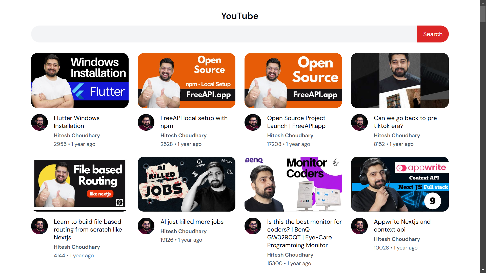

# YouTube List Application

## Features

- Fetch and display a list of YouTube videos.
- Show video thumbnails, titles, and channel names.
- Click on a video to open it in YouTube.
- Add a search bar to filter videos.
- Filteration should be done on frontend without any additional api calls
- Implement a grid layout for better UI.

## Screenshots



## Deployment Link

[Live Demo]()

## How to Use

1. Display a list of YouTube videos.
2. Search videos by entering keyword in the search box.
3. Click on video to view on youtube.
4. You can see how old that video is.
5. You can see who the owner of that video is.

## Installation

1. Clone the repository:
   ```sh
   git clone https://github.com/janarahul1234/YouTube-List.git
   ```
2. Open `index.html` in a browser.
3. Start tracking your moods!

## Technologies Used

- HTML
- CSS
- JavaScript

## Contributing

Feel free to submit issues or pull requests to improve the application.

## License

This project is open-source and available under the [MIT License](LICENSE).
